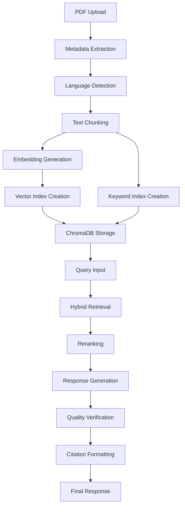

# 🤖  Agentic RAG System

A  Retrieval-Augmented Generation (RAG) system with hybrid search capabilities, multi-language support, and advanced document processing for  document analysis.

##  Key Features

### Core Capabilities
- ✅ **Interactive Chat Interface** - Streamlit-based UI with  conversation tracking
- ✅ **Advanced PDF Processing** - Multi-format document support with metadata extraction
- ✅ **Optional LlamaParse Integration** - Use LlamaParse API for advanced document parsing 
- ✅ **Hybrid Search Engine** - Combines vector similarity and keyword matching
- ✅ **Enhanced Citations** - Detailed source references with page numbers and confidence scores
- ✅ **Multi-language Support** - Specialized Arabic and English processing with language detection
- ✅ **Conversation Memory** - Full chat history with technical metadata

### Advanced Features
-  **Intelligent Chunking** - Configurable sentence splitting with semantic overlap
-  **Multi-Model Reranking** - SentenceTransformer-based result optimization  
-  **Response Verification** - Built-in hallucination detection and quality assurance
-  **Metadata Enhancement** - Comprehensive document tracking and analysis
-  **Performance Optimization** - Dynamic parameter tuning and caching

### Technical Architecture
- **LLM**: Google Gemini 2.0 Flash via GoogleGenAI integration
- **Embeddings**: BAAI/bge-m3 multilingual embeddings with HuggingFace
- **Vector Store**: ChromaDB with persistent storage and language-specific collections
- **Retrieval**: Custom HybridRetriever with intelligent score fusion
- **Framework**: LlamaIndex with  pipeline components
- **Frontend**: Streamlit with comprehensive configuration sidebar

## 🚀 Quick Start

### Prerequisites

- Python 3.8+
- Google Gemini API key
- 8GB+ RAM recommended
- 2GB+ disk space for vector storage

### 1. Clone and Setup

```bash
git clone git@github.com:ZOHRAABDELI/Agentic-RAG.git

# Create virtual environment
python -m venv venv
source venv/bin/activate  # On Windows: venv\Scripts\activate

# Install dependencies
pip install -r requirements.txt
```

### 2. Environment Configuration

Create `.env` file with your API keys:

```bash
# Required API Keys
GEMINI_API_KEY=your_gemini_api_key_here
# Optional: For LlamaParse document parsing
LLAMAPARSE_API_KEY=your_llamaparse_api_key_here
```

### 3. Run Application

```bash
# Start the Streamlit app
streamlit run app.py

# App will be available at http://localhost:8501
```

## 📖 Usage Guide

### Document Processing Workflow

1. **Upload Documents**: 
   - Use sidebar file uploader for PDFs
   - System supports multiple files simultaneously
   - Automatic metadata extraction and enhancement
   - **Optionally enable LlamaParse** in the sidebar for advanced parsing (requires API key)

2. **Processing Pipeline**:
   - Language detection (Arabic/English/Other)
   - Intelligent document chunking with configurable overlap
   - Separate vector and keyword index creation per language
   - ChromaDB persistent storage with language-specific collections
   - **If LlamaParse is enabled, documents are parsed using the LlamaParse API**

3. **Index Creation**:
   ```
   📄 Documents → 🔤 Language Detection → ✂️ Chunking → 
   🎯 Embeddings → 💾 Vector Store + 🗝️ Keyword Index
   ```

### Query Processing Flow

1. **Query Input**: Natural language questions in chat interface
2. **Language Detection**: Automatic query language identification  
3. **Hybrid Retrieval**: 
   - Vector similarity search (BGE-M3 embeddings)
   - Keyword matching with SimpleKeywordTableIndex
   - Intelligent score fusion with configurable alpha weighting
4. **Reranking**: SentenceTransformer cross-encoder optimization
5. **Response Generation**: 
   - Context-aware prompt engineering
   - Gemini 2.0 Flash for high-quality responses
   - Enhanced citation formatting with source tracking
6. **Quality Verification**: Built-in response validation and issue detection

## 🏗️ Architecture Deep Dive

### Core Components

#### 1. Document Processing Pipeline
```python
# Enhanced metadata extraction
MetadataEnhancer → Language Detection → 
SentenceSplitter → IngestionPipeline → Index Creation
```

**Key Features**:
- Automatic file metadata extraction (size, type, hash)
- Language-specific processing with Arabic text normalization
- Configurable chunking strategies (sentence/semantic/fixed)
- Enhanced node metadata with processing timestamps

#### 2. Hybrid Retrieval System
```python
class HybridRetriever(BaseRetriever):
    - Vector Index (ChromaDB + BGE-M3)
    - Keyword Index (SimpleKeywordTableIndex)  
    - Score Fusion (α * vector_score + (1-α) * keyword_score)
    - Similarity Thresholding
```

**Configuration**:
- Vector Top-K: 90 (configurable)
- Keyword Top-K: 80 (configurable) 
- Alpha weighting: 0.7 (favor vector search)
- Final results: 30 after reranking

#### 3. Advanced Citation System
```python
def format_citations_enhanced():
    - Multi-source metadata extraction
    - Relevance score integration
    - Page number and section tracking
    - Deduplication and validation
```

**Citation Format**:
```
📄 Document_Name.pdf | Page 15 | Section 2.1 | (Relevance: 0.85)
```

#### 4. Response Verification
```python
class ResponseVerifier:
    - Relevance scoring (query-response alignment)
    - Grounding verification (context-response overlap)
    - Hallucination detection (uncertainty patterns)
    - Length and quality validation
```

### Enhanced Features Implementation

#### Multi-Language Support
- **Language Detection**: Character-based + langdetect library
- **Arabic Processing**: Diacritic removal, character normalization
- **Separate Indices**: Language-specific ChromaDB collections
- **Localized Prompts**: Arabic and English system prompts

#### Advanced Prompting
- **Anti-Hallucination**: Strict context-only instructions
- **Completeness Emphasis**: Full document search requirements
- **Citation Mandates**: Mandatory source referencing
- **Quality Checks**: Response verification integration

#### Performance Optimizations
- **MockLLM for Indexing**: Prevents API rate limits during setup
- **Caching**: Session state management for indices
- **Batch Processing**: Efficient document pipeline
- **Memory Management**: Optimized chunk sizes and overlap

## ⚙️ Configuration Options

### Core Settings (constants.py)

```python
# Model Configuration
LLM_MODEL_NAME = "models/gemini-2.0-flash"
EMBEDDING_MODEL_NAME = "BAAI/bge-m3"

# Retrieval Parameters  
VECTOR_TOP_K = 90
KEYWORD_TOP_K = 80
FINAL_TOP_K = 30
SIMILARITY_THRESHOLD = 0.5

# Document Processing
CHUNK_SIZE = 1200
CHUNK_OVERLAP = 400
MAX_FILE_SIZE = 100 * 1024 * 1024  # 100MB

# Advanced Features
ENABLE_RERANKING = True
ENABLE_HYBRID_SEARCH = True
ENABLE_RESPONSE_VERIFICATION = True
```

### Sidebar Configuration

The Streamlit sidebar provides real-time configuration:
- **Document Management**: Upload, process, clear data
- **LlamaParse Option**: Checkbox to enable LlamaParse for document parsing
- **Metadata Inspection**: File details and processing info
- **Index Statistics**: Language distribution, node counts
- **Performance Metrics**: Processing times, response quality

### ChromaDB Collections

```python
CHROMA_COLLECTIONS = {
    "arabic": "documents_ar_v2",
    "english": "documents_en_v2", 
    "other": "documents_other_v2",
    "unified": "documents_unified_v2"
}
```

## 📊 Performance & Monitoring

### Built-in Analytics

The application tracks comprehensive metrics:

- **Query Analytics**: Language distribution, response times
- **Retrieval Metrics**: Source counts, confidence scores  
- **Quality Indicators**: Verification results, issue detection
- **Processing Statistics**: Document counts, index sizes

### Quality Assurance

```python
# Automatic response verification
verification_result = {
    'is_valid': True/False,
    'issues': 'List of detected problems', 
    'relevance_score': 0.0-1.0,
    'grounding_score': 0.0-1.0,
    'response_length': int
}
```

## 🔧 Troubleshooting

### Common Issues

#### 1. API Key Errors
```bash
# Verify environment setup
echo $GEMINI_API_KEY

# Check .env file
cat .env | grep GEMINI_API_KEY
```

#### 2. Document Processing Failures
- **File Size**: Check 100MB limit per file
- **Format Support**: Ensure PDF compatibility
- **Memory Issues**: Reduce chunk_size if needed
- **Language Detection**: Verify text content quality

#### 3. Poor Search Results
```python
# Adjust retrieval parameters
SIMILARITY_THRESHOLD = 0.3  
VECTOR_TOP_K = 100          
ENABLE_RERANKING = True   
```

#### 4. Performance Issues
- **Memory Usage**: Clear data regularly via sidebar
- **Processing Speed**: Reduce CHUNK_SIZE and VECTOR_TOP_K
- **Response Time**: Disable reranking for faster responses

### Debug Mode

Enable detailed logging:
```bash
DEBUG_MODE=True
VERBOSE_LOGGING=True
```

This provides:
- Detailed processing logs
- Error stack traces  
- Performance timing
- Component status info


## 🔄 System Workflow

### Complete Processing Pipeline



### Session Management

- **Index Persistence**: ChromaDB maintains indices across sessions
- **Memory Management**: Streamlit session state for active data
- **Configuration**: Runtime parameter adjustment via sidebar
- **History Tracking**: Complete conversation logs with metadata

## 📚 API Integration

### Google Gemini Setup

1. **Get API Key**:
   - Visit [Google AI Studio](https://makersuite.google.com/app/apikey)
   - Create new project and generate API key
   - Add to `.env` file

2. **Model Configuration**:
   ```python
   llm = GoogleGenAI(
       model="models/gemini-2.0-flash",
       api_key=gemini_api_key,
       temperature=0.0,
       max_tokens=4096
   )
   ```

### Embedding Model

The system uses BAAI/bge-m3 for multilingual embeddings:
- **Languages**: 100+ languages supported
- **Dimensions**: 1024-dimensional vectors
- **Performance**: Optimized for semantic search
- **Normalization**: L2 normalization for better similarity

## 🤝 Contributing

### Development Setup
```bash
# Clone repository
git clone <repo-url>

# Setup development environment  
python -m venv dev-env
source dev-env/bin/activate
pip install -r requirements.txt

# Run in development mode
DEBUG_MODE=True streamlit run app.py
```

### Code Structure
- `app.py`: Main Streamlit application
- `constants.py`: Configuration and constants
- `utils.py`: Utility functions and classes
- `requirements.txt`: Python dependencies

### Adding Features
1. Fork repository and create feature branch
2. Implement changes with proper error handling
3. Update constants.py for new configurations  
4. Test with multiple document types and languages
5. Submit pull request with detailed description

- my email : abdelizohr@gmail.com
- my linkedin : linkedin.com/in/zohra-abdeli/